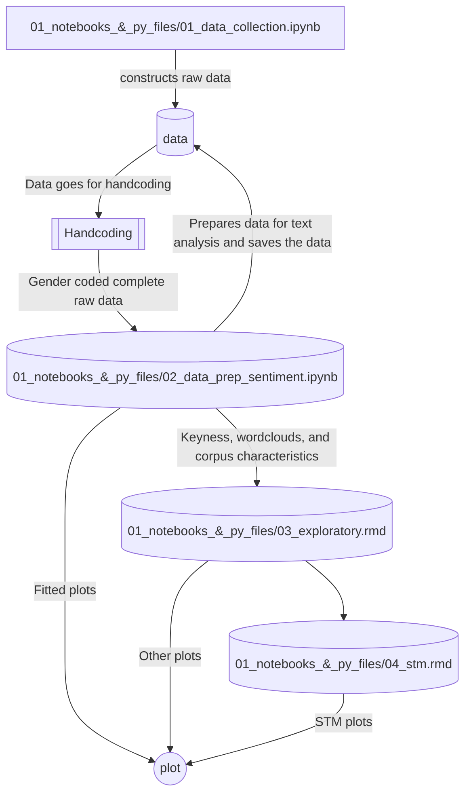

# Gender_Stereotyping_Artists

This repository contains codes to reproduce the results of the research paper "X". I have used Python to collect and clean data, and both Python and RStudio for text analysis. I have mentioned the runtime of each computationally expensive codes on top of it and the reproduction of the research requires following the file sequence in the `01_notebooks_&_py_files` folder. 

The following mermaid plot illustrates the data journey,

